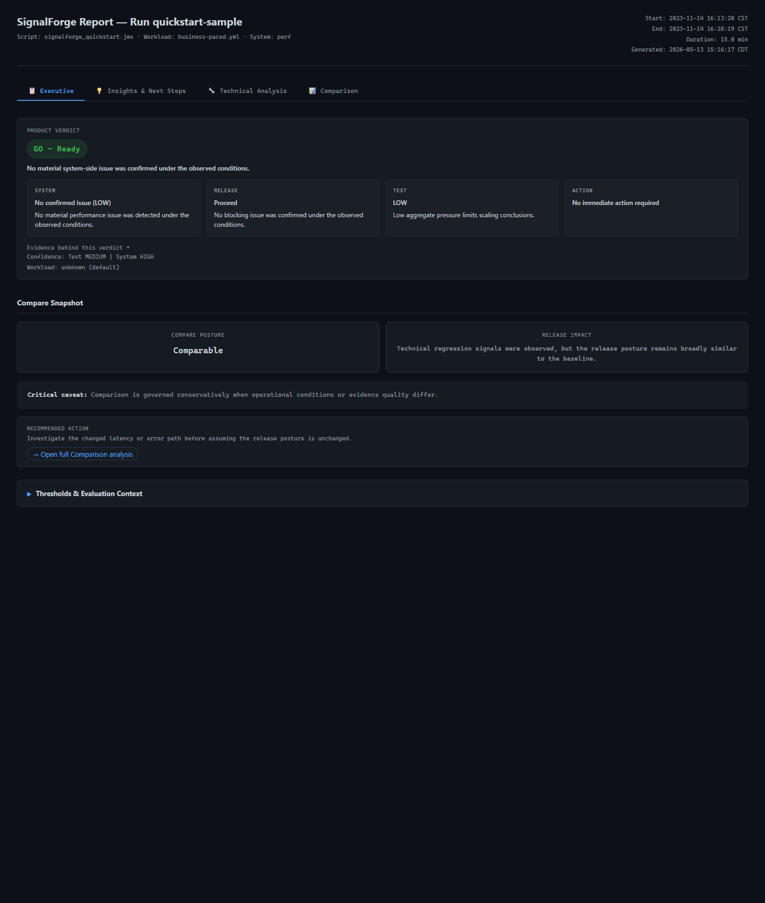
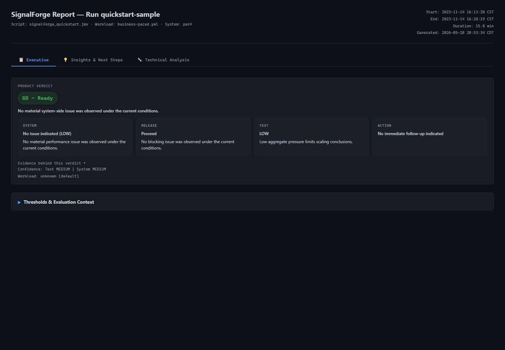
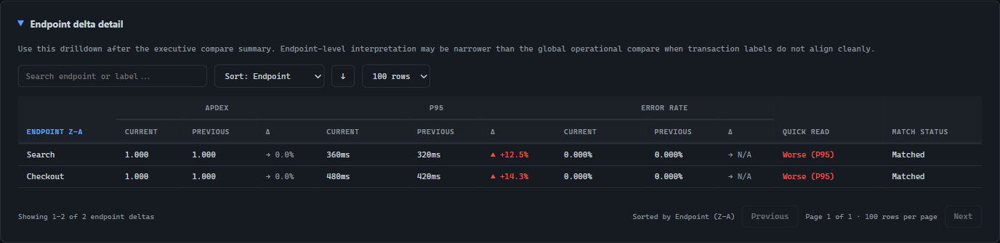
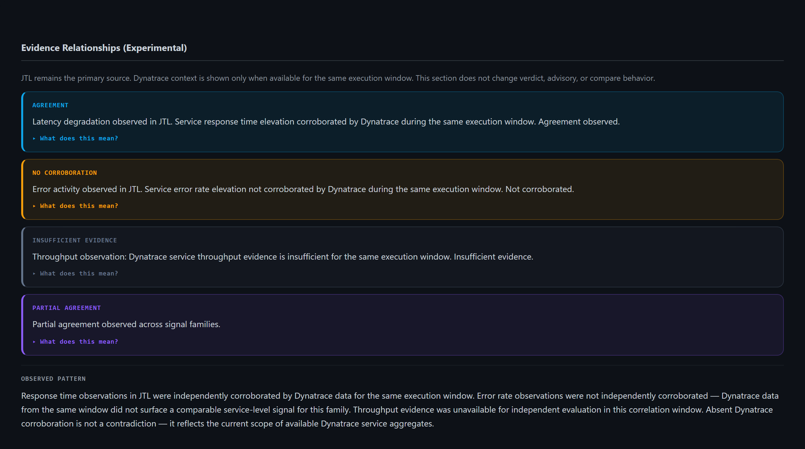

# SignalForge Preview

A local, repeatable investigation workflow for JTL-based load test reviews.

SignalForge helps Performance Engineers turn raw JMeter/JTL evidence into a structured first read: verdict, risks, endpoint evidence, compare findings, and optional bounded Dynatrace context.

It is not a load generator, not an observability platform, and not a generic HTML export — and it is not trying to replace the Performance Engineer, JMeter, Dynatrace, or an LLM. The goal is to produce a consistent technical artifact that can be reviewed, challenged, shared, or discussed further.

## Local CLI, Fast First Read

```text
signalforge compare examples/quickstart/sample.jtl examples/quickstart/baseline.jtl

=== SignalForge Product Verdict ===
GO - Ready
Release: Proceed

=== SignalForge Compare Summary ===
Overall Compare Posture: Comparable
Comparison Context: Medium
Signal: Regression observed
Context: Current-run thresholds may pass while compare still shows degradation against the baseline.
```

That combination matters:

- the CLI gives you a fast release-oriented read
- the HTML report gives you the evidence behind it
- the compare workflow makes regressions easier to review than a raw JTL diff

In compare mode, `Signal: Regression observed` does not automatically mean the overall release posture flipped to `FAIL`. It means the run changed in a way that deserves review, even when the broader compare posture still reads as `Comparable`.

## Compare-First Review



## How This Fits With LLMs

LLMs are useful for exploration, explanation, and turning technical findings into summaries.

SignalForge focuses on the step before that: producing a repeatable, local, inspectable investigation artifact from the same performance evidence.

In practice, SignalForge can generate the structured first read, and a Performance Engineer can then use their own judgment — or even an LLM — to discuss, summarize, or communicate the findings.

Same input. Same rules. Same report structure. That consistency matters when the output needs to be reviewed, compared, or defended.

## Why SignalForge Preview

- Compare comes first. The strongest workflow is not just "render one report," but "show me what changed and whether it matters."
- The output is release-oriented. The report is built to help engineers, QA leads, and technical managers scan risk quickly.
- Endpoint evidence stays visible. You can move from executive summary to endpoint-level changes without leaving the report.
- The workflow stays local. JTL in, CLI plus HTML out, no hosted platform required for the basic preview path.
- Healthy runs still read cleanly. The tool is not only for red failure cases or catastrophic demos.

## Quickstart

The fastest path is:

1. download the preview bundle
2. unzip it
3. run the commands below from the unzipped bundle root

The current documented preview path is Windows-first. It is the path that has been validated most heavily for this preview surface.

```powershell
py -3 -m venv .venv
.\.venv\Scripts\python.exe -m pip install .\dist\signalforge_preview-0.1.1-py3-none-any.whl
cmd /c ".venv\Scripts\activate.bat && signalforge run examples/quickstart/sample.jtl --config examples/quickstart/sample_run_config.csv"
cmd /c ".venv\Scripts\activate.bat && signalforge compare examples/quickstart/sample.jtl examples/quickstart/baseline.jtl --config examples/quickstart/sample_run_config.csv --compare-config examples/quickstart/baseline_run_config.csv"
cmd /c ".venv\Scripts\activate.bat && signalforge run examples/quickstart/sample_degraded.jtl --config examples/quickstart/sample_run_config.csv"
```

What to expect:

- the single-run command writes an HTML report next to the sample JTL unless `--output` is provided
- the compare command writes a compare report that highlights posture, deltas, and endpoint changes
- the degraded sample intentionally shows how a problematic run is presented; a `FAIL` exit code is expected for that sample
- the preview also writes a resolved run-context file and transaction CSV exports next to the generated HTML
- the sample config files make the demo report identity and context cleaner, but your own JTLs can still be reviewed without advanced setup

More detail:

- [Install notes](./docs/install.md)
- [Quickstart walkthrough](./docs/quickstart.md)
- [Azure DevOps notes](./docs/azure-devops.md)

## Single-Run Executive View



Single-run still matters. A calm healthy run should be readable without noise, and a reviewer should be able to find the top-line verdict, release posture, and next action in a few seconds.

## Why Compare Matters

A single run can tell you whether a result looks healthy or risky. Compare tells you whether a new run changed in a way that deserves attention.

SignalForge Preview is strongest when you want to:

- review a candidate run against a baseline
- see whether the release posture actually shifted
- identify which endpoints changed the most
- keep the summary readable for both hands-on engineers and review stakeholders

## Endpoint-Level Evidence



The compare surface is not only a headline. It also gives you endpoint-level evidence so you can inspect changed transactions, search quickly, and sort the drilldown by the dimension that matters most.

## Thresholds & Evaluation Context

SignalForge can run directly against a JTL with no extra config. In that case, the preview uses generic defaults so the report can still produce a readable verdict and compare posture.

These are preview defaults, not your production SLAs, SLOs, NFRs, or release policy.

| Category | Current preview support |
| --- | --- |
| Stable public overrides | Yes, a small subset |
| Advanced context enrichment | Partial |
| Full evaluation-policy tuning | Not yet exposed |

| Default | Current preview value | Used for |
| --- | --- | --- |
| APDEX T | `1000 ms` | APDEX scoring |
| P95 latency target | `5000 ms` | default global latency evaluation |
| Error-rate target | `2.0%` | default global error evaluation |
| Compare degradation threshold | `10%` | meaningful compare delta classification |
| Minimum samples per endpoint | `200` | endpoint-level sufficiency checks |
| Normalization sample floor | `500 total samples` | aggregate sample-quality classification |
| Minimum representative duration | `10 min` | representative-duration checks |

Verdicts are directional guidance, not automatic release authority. They should be interpreted with workload, business, and system context.

What you can tune cleanly today:

- `--apdex-t` changes the APDEX target used for the current run
- `--degradation-threshold` changes how sensitive compare mode is to visible deltas

`--context` and `--profile` are mainly for workload context, environment metadata, compare context, and report provenance. They are useful, but they are not yet a full public threshold-tuning surface.

Some policy checks remain intentionally fixed in the preview, including sample sufficiency, normalization floors, and representative-duration guidance. That keeps first-run interpretation more consistent and avoids noisy conclusions from weak evidence.

Aggressive tuning can make the output easier to misread. Lower thresholds can increase noise sensitivity, and low-sample compares can make percentiles or deltas look more certain than they really are.

Generated reports also include a `Thresholds & Evaluation Context` section so reviewers can see whether visible decision criteria came from preview defaults or custom inputs.

For a little more detail, see [Evaluation defaults](./docs/evaluation-defaults.md) and [Configuration notes](./docs/config-contract.md).

## Preview Scope

This preview is intentionally focused:

- JTL-first input
- local-first workflow
- CLI plus HTML review flow
- single-run interpretation
- compare-oriented regression review
- optional experimental Dynatrace enrichment for advanced users

This preview is intentionally not:

- a hosted SaaS product
- an observability platform
- a load generator
- an automated release authority
- broad APM support

## Known Limitations

- This is still a preview surface, not a broad public release.
- The current public demo set is intentionally small and curated.
- Dynatrace enrichment is optional, experimental, and advanced-only.
- Endpoint demo data is useful today, but still lighter than a richer future curated fixture.

For a concise limitations summary, see [Known limitations](./docs/known-limitations.md).

## Download Preview

**[Download SignalForge Preview 0.1.1](https://github.com/JorgeBeltranF/signalforge-preview/releases/download/v0.1.1-preview/signalforge-preview-0.1.1-bundle.zip)**

Includes:

- the preview CLI package
- safe sample JTLs
- the degraded sample JTL
- sample config files
- install instructions
- the screenshot set shown here

If you only want the runnable preview path, start with the bundle above instead of browsing the repo tree first.

## Engineering Source

If you are evaluating SignalForge and would like to discuss access to the engineering source, open an issue in this repository. There is no formal application process — if the interest is genuine, the conversation will follow.

## Preview License

SignalForge Preview is currently distributed as a source-available technical preview for evaluation, internal experimentation, and technical feedback. The public GitHub repo is a curated preview surface, and the runnable preview source is shipped inside the installable bundle.

It is not yet offered under a final open source or commercial license. See [LICENSE](./LICENSE) for the current preview terms.

## Feedback

Useful feedback for this preview includes:

- install friction
- time to first useful insight
- compare usefulness
- confusing wording
- trust concerns

See [Feedback](./docs/feedback.md).

## Experimental Dynatrace

Dynatrace enrichment is included as an optional advanced preview path. It is YAML-only, uses token references through environment variables, and is limited to three bounded service-signal families.

It does not change Product Verdict, Release, Advisory, Compare, JSON, or CI exit-code behavior. JTL analysis works fully without Dynatrace.

When Dynatrace enrichment returns data for the same execution window, the Insights tab adds an experimental Evidence Relationships section. It shows, per signal family, whether a JTL observation was independently corroborated by Dynatrace — without claiming causality.



See [Experimental Dynatrace](./docs/experimental-dynatrace.md).

## Preview Notice

SignalForge Preview is meant to be practical, not theatrical. The goal is to make JTL review and compare easier to understand, easier to discuss, and easier to act on without pretending to replace engineering judgment.

## Preview Direction

Planned workflow expansion may include:

- historical compare and review workflows
- broader release-review analysis flows
- broader integration ideas after real preview feedback

These are not part of the current preview workflow.
